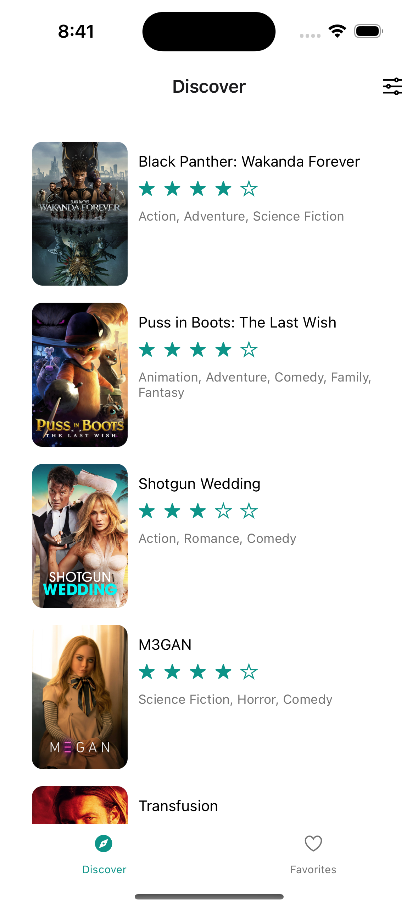
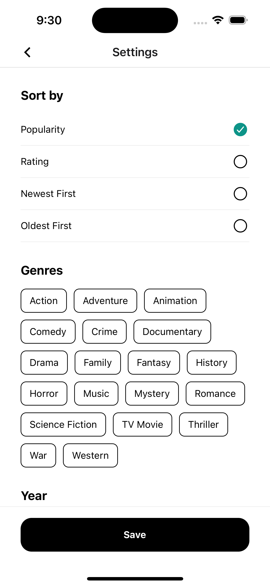
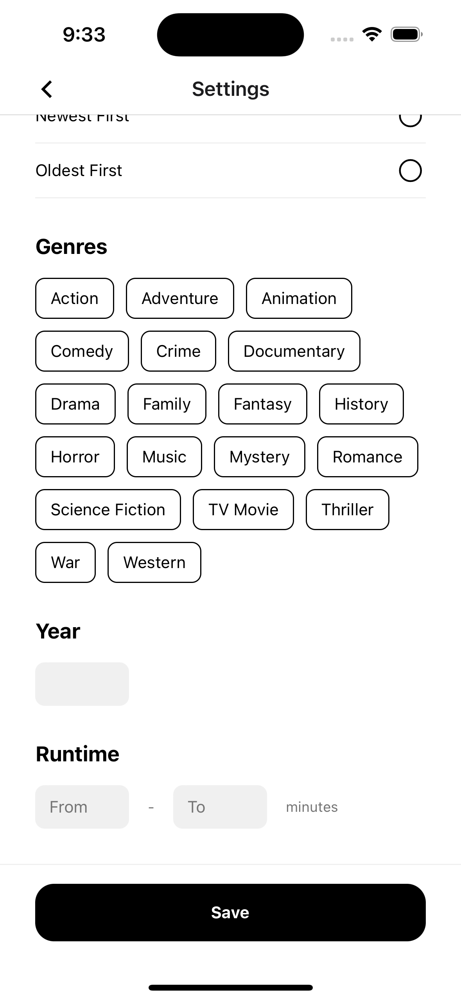
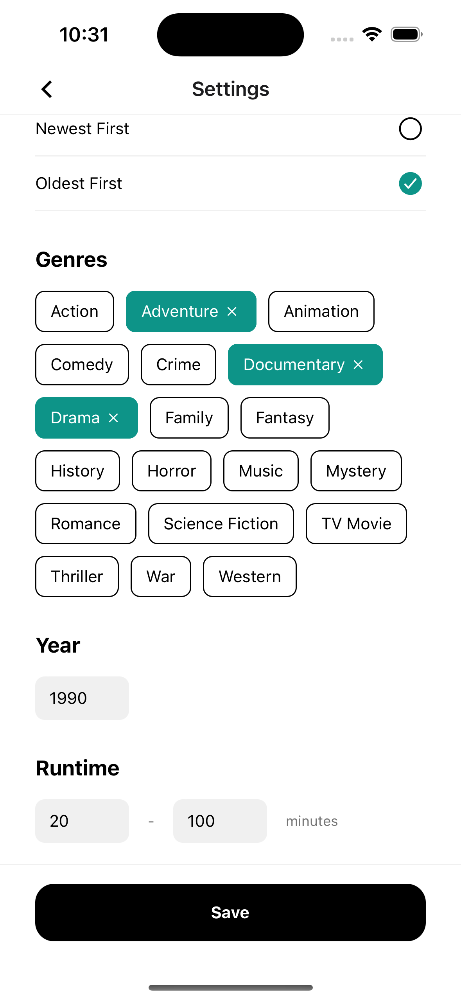
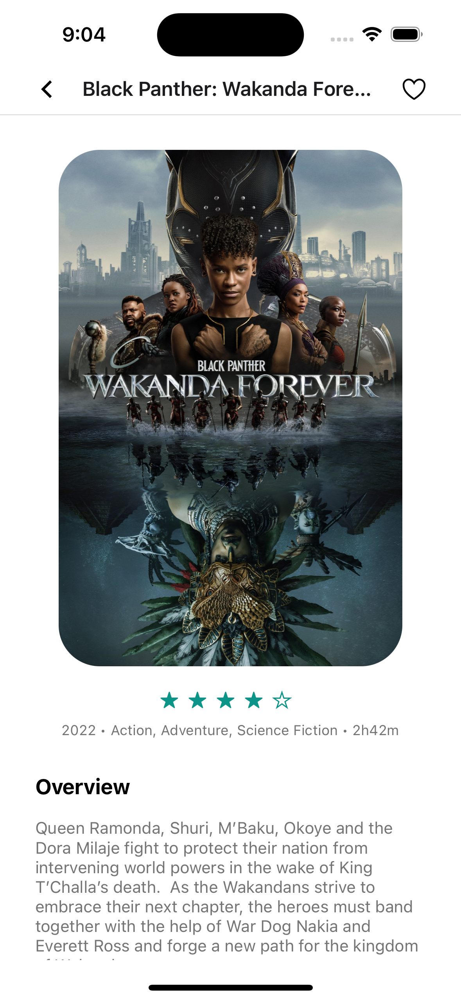
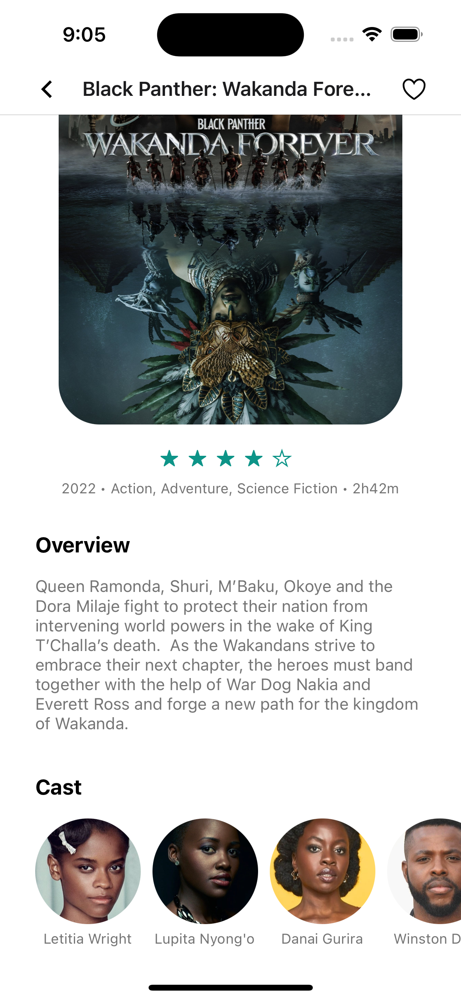
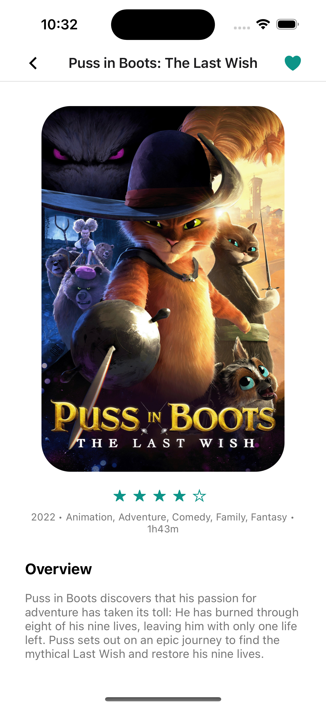
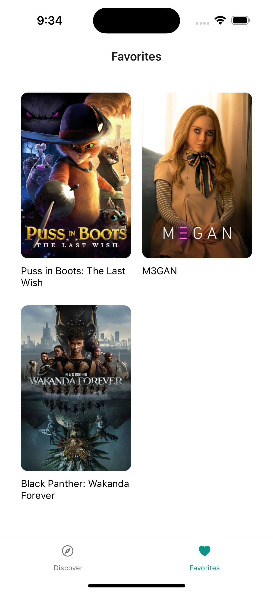

# Requirements

- Please try to implement the screens as close as possible to the screenshots provided. We don't expect them to be pixel-perfect, specially considering screnshots are not the best handoff material. We don't expect you to use the same exact margins, paddings or widths/heights, but we do expect you to use the same colors and structure. If there's a border-radius, it should be clear when something is only slightly rounded and when something is a full circle.
- The app should support the latest versions of iOS and Android.
- The app should have a comprehensive test suite. Try to add as many relevant tests as possible. All major functionalities should be tested.
- The app doesn't need to support iPad or tablets. But it should support different screen sizes for phones just like any real-world app would.
- You can use any external library, native or not. However, carefully consider the impact on the maintainability of the app before adding third-party code.
- All colors are included in the project. Please make use of them.
- There's already an included library for icons. There's no need to add more than what's included. Feel free to use any icon in there. No need to use the same exact ones that we used.
- Throughout this file, we have included the name of the fields in the API to help you. They are usually between parenthesis and backticks like so: (`vote_average`).
- To know how to get the full URL for images, please refer to the API documentation.

## Screens

### Discover

This is the initial screen of the app. We want you to implement the design here:

#### Implementation Notes

- The title of the screen should be `Discover`
- The header should contain a button that takes you to the `Settings` screen that already exists. Use whatever icon you prefer.
- The screen currently contains an empty state. If the list doesn't contain any results, let's keep showing the same empty state.
- The screen should display a list of movies that come from the [Movie Discover endpoint](https://developers.themoviedb.org/3/discover/movie-discover) (`/discover/movie`). Each movie in the list should contain the image (`poster_path`), the rating (`vote_average`) and a comma-separated list of genres (`genre_ids`). Since the endpoint returns only ids, you'll need to get the full genre information from a different endpoint.
- When a movie in the list is tapped, the app should navigate to the `Details` screen that already exists.
- The list should support pagination. As you scroll, more items should be loaded in the background. This is usually called Infinite Scroll. The endpoint does support pagination.
- Once the settings screen is implemented, all the settings selected there, should affect the items displayed here. A user should be able to change the sorting (`sort_by`), filter by genres (`with_genres`), year (`year`) and duration (`with_runtime.gte` and `with_runtime.lte`).

### Settings

You can access this screen by tapping on the top right button in the header of the Discover screen. This button should have been implemented in the previous screen. The screen already exists and most of the design is fully implemented. However the form isn't working correctly and we need to integrate it with the Discover screen.

#### Implementation Notes

- The title should be `Settings`.
- When a new `Sort by` option is tapped, a checkbox should be displayed at the right. All the non-selected options should have an empty circle like the screenshots 1 and 2 above. Only one option can be selected at a time.
- Multiple genres can be selected at the same time. When a genre is selected, it should have a teal background and an `X` icon to indicate that you can remove it. See the third screenshot above. When a genre is not selected a rounded black border should be used instead. To get the list of genres to display, you'll need to query them from the [Movie Genre endpoint](https://developers.themoviedb.org/3/genres/get-movie-list) (`/genre/movie/list`)
- Year and runtime use regular text inputs. The user should not be able to enter a runtime range that doesn't make sense. For example, the second input should always have a higher number than the first input.
- The save button should always be at the bottom of the screen and should not move as you scroll. This is sometimes called sticky footer.
- Once the Save button is tapped, the user should return to the Discover screen and apply the selected options to the query. The Movie Discover endpoint already supports all these options and they are specified in the Discover section above. They are `sort_by`, `with_genres`, `year`, `with_runtime.gte` and, `with_runtime.lte`. The list in Discover should be updated to reflect movies the satisfy the criteria in the Settings screen.

### Details

You can access this screen by tapping on a movie throughout the app. This screen already exists and has most of the design implemented already.

#### Implementation Notes

- The title of the screen should be the title of the movie (`title` in the API).
- The header should contain a button to mark a movie as favorite (or like if you will). Pressing this button should add/remove the movie to/from a list of favorite movies and store that information in the device's storage so that it can persist when the app is closed. If the movie is not in the favorites list, the button should be transparent as indicated by the first and second screenshot. If the movie is in the list of favorites, the button should change to teal as indicated in the third screenshot.
- The data displayed in the screen should come from the [Movie Details endpoint](https://developers.themoviedb.org/3/movies/get-movie-details) `/movie/{movie_id}`. You need to get the ID from the previous screen, at the moment the user taps a movie in the list.
- The screen should contain the image (`poster_path`) that fills almost the whole width of the screen, as indicated by the design, the rating (`vote_average`), the release year (`release_date`), a comma-separated list of genres (`genres`), the duration (`runtime`), an overview and a horizontally-scrollable list of actors (`cast`) Please use the same display format that's in the screenshots.
- The cast isn't immediately available in the endpoint. You can get that information from the [credits endpoint](https://developers.themoviedb.org/3/movies/get-movie-credits) (`/movie/{movie_id}/credits`) or you can use the `append_to_response` option of the movie details endpoint to get everything on a single request. It's up to you.
- Since the screen is a bit long, the user should be able to scroll vertically to see everything available. This is in addition to the cast list supporting horizontal scroll.

### Favorites

You can access this screen with the Favorites tab at the bottom. We want you to implement the design here:

#### Implementation Notes

- The title should be `Favorites`.
- The screen currently contains an empty state. If there are no movies marked as favorites, let's keep showing the same empty state.
- The screen should display a list of movies that have been marked as favorites at any point. Since we're storing that data in the device's storage, we need to read from that same storage to display the data here.
- The movies should be displayed in a 2-column grid. Each item on the grid should contain the image and the title of the movie that was added to Favorites. Please see the screenshot above.
- When a movie from the list is tapped, the user should be taken to the `Details` screen. The same one that you see when you tap on a movie throughout the app. If you navigate from the Favorites screen to the Details screen to see information about a specific movie, and you remove the movie from favorites, when you hit back, you should no longer see the movie in the Favorites list.
